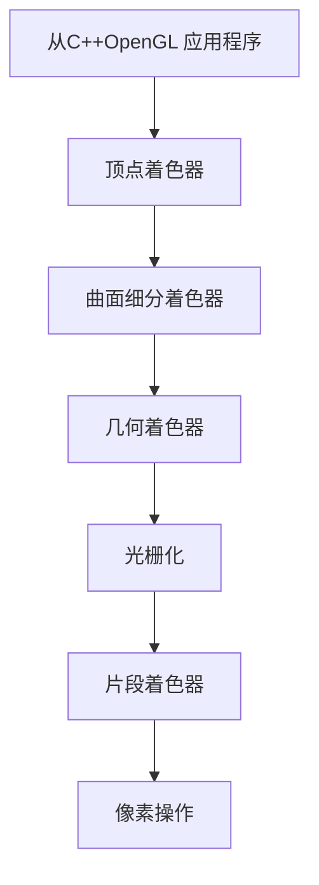

## chapter-2

在硬件方面，OpenGL提供了一个多级图形管线，可以使用一种名为GLSL的语言进行部分编程。

GLSL是一种着色器语言。着色器语言主要运行于GPU上，在图形管线上下文中。

还有一些其他的着色器语言，如HLSL，用于微软的3D框架DirectX。

```mermaid
flowchart TD
    A[从C++OpenGL 应用程序] --> B[顶点着色器]
    B --> C[曲面细分着色器]
    C --> D[几何着色器]
    D --> E[光栅化]
    E --> F[片段着色器]
    F --> G[像素操作]
```
